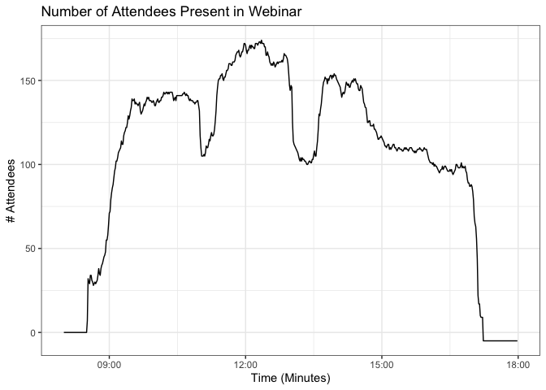
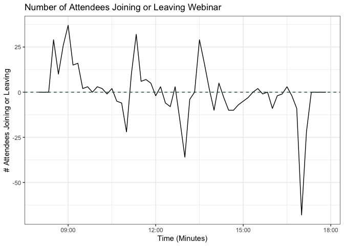
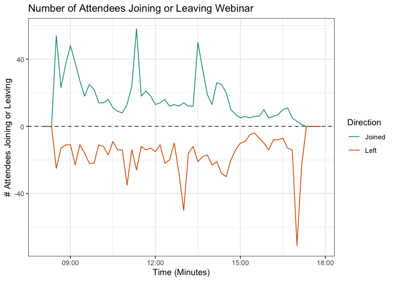

<!-- README.md is generated from README.Rmd. Please edit that file -->
ZoomReports
===========

The goal of ZoomReports is to ...

Installation
------------

``` r
install.packages("ZoomReports")
```

Example
-------

First, let's load the package.

``` r
library(ZoomReports)
```

We provide an example of a typical **attendee report** provided after a Zoom Webinar.

``` r
attend <- system.file("extdata",
                      "Anonymized_Zoom_Attendee_Report.csv",
                      package = "ZoomReports" )
```

    #>  [1] "Attendee Report,"                                                                                                                     
    #>  [2] "Report Generated:,\"Apr 09, 2020 8:50 PM\""                                                                                           
    #>  [3] "Topic,Webinar ID,Actual Start Time,Actual Duration (minutes),# Registered,# Cancelled,Unique Viewers,Total Users,Max Concurrent Views"
    #>  [4] "satRdays DC 2020,328-972-509,\"Mar 28, 2020 8:07 AM\", 548, 461, 0,446,991,0"                                                         
    #>  [5] "Host Details,"                                                                                                                        
    #>  [6] "Attended,User Name,Email,Join Time,Leave Time,Time in Session (minutes),Country/Region Name"                                          
    #>  [7] "Yes,hostName_1,hostName_1@email.com,\"Mar 28, 2020 08:07:27\",\"Mar 28, 2020 17:14:45\",548,United States of America"                 
    #>  [8] "Panelist Details,"                                                                                                                    
    #>  [9] "\"Attended\",\"User Name\",\"Email\",\"Join Time\",\"Leave Time\",\"Time in Session (minutes)\",\"Country/Region Name\""              
    #> [10] "\"Yes\",\"userName_1\",\"attendee327@email.com\",\"Mar 28, 2020 09:39:09\",\"Mar 28, 2020 10:03:38\",25,\"United States of America\""

This single file contains 5 seperate CSV datasets: **Attendee Report**, **Host Details**, **Panelist Details**, **Attendee Details**, and **Other Details**. We are only interested in the data contained in **Attendee Details**.

``` r
attendees <- getAttendees(attend)
```

| Attended | First Name         | Last Name         | Email                   | Registration Time     | Approval Status | Join Time             | Leave Time            | Time in Session (minutes) | Country/Region Name      |
|:---------|:-------------------|:------------------|:------------------------|:----------------------|:----------------|:----------------------|:----------------------|:--------------------------|:-------------------------|
| Yes      | firstAttendee\_130 | lastAttendee\_130 | <attendee130@email.com> | Mar 28, 2020 09:07:11 | approved        | Mar 28, 2020 09:07:39 | Mar 28, 2020 09:26:54 | 20                        | United States of America |
| Yes      | firstAttendee\_52  | lastAttendee\_52  | <attendee52@email.com>  | Mar 28, 2020 09:20:09 | approved        | Mar 28, 2020 09:20:36 | Mar 28, 2020 09:57:38 | 38                        | United States of America |
| Yes      | firstAttendee\_52  | lastAttendee\_52  | <attendee52@email.com>  | NA                    | NA              | Mar 28, 2020 09:49:50 | Mar 28, 2020 09:51:42 | 2                         | United States of America |

We can use this data to examine the country of our attendees.

``` r
countries <- getCountryInfo(attendees)
```

| Country                  |  Attendees|  Average Time (Min/Attendee)|
|:-------------------------|----------:|----------------------------:|
| United States of America |        328|                       157.35|
| --                       |         16|                         0.00|
| United Kingdom           |         15|                       157.93|
| Canada                   |          8|                       194.75|
| Spain                    |          8|                        41.12|
| Germany                  |          7|                       150.00|

Now let's look at the amount of attendees that joined or left the webinar over either 1 minute intervals or 10 minute intervals.

``` r
start_time <- "2020-03-28 08:00"
end_time <- "2020-03-28 18:00"

intervals_01 <- createIntervals(start_time, end_time, 1)
intervals_10 <- createIntervals(start_time, end_time, 10)
```

The out put of create intervals is simply a vector of time intervals.

    #> [1] 2020-03-28 08:00:00 UTC--2020-03-28 08:10:00 UTC
    #> [2] 2020-03-28 08:10:00 UTC--2020-03-28 08:20:00 UTC
    #> [3] 2020-03-28 08:20:00 UTC--2020-03-28 08:30:00 UTC
    #> [4] 2020-03-28 08:30:00 UTC--2020-03-28 08:40:00 UTC
    #> [5] 2020-03-28 08:40:00 UTC--2020-03-28 08:50:00 UTC
    #> [6] 2020-03-28 08:50:00 UTC--2020-03-28 09:00:00 UTC
    #> [7] 2020-03-28 09:00:00 UTC--2020-03-28 09:10:00 UTC

We can use this to bin the number of attendees that either join or leave during that interval.

``` r
timeData_01 <- getTimeData(intervals_01, attendees)
timeData_10 <- getTimeData(intervals_10, attendees)
```

|                                          interval| begin               |  joined|  left|  total|  cum\_total|
|-------------------------------------------------:|:--------------------|-------:|-----:|------:|-----------:|
|  2020-03-28 08:00:00 UTC--2020-03-28 08:10:00 UTC| 2020-03-28 08:00:00 |       0|     0|      0|           0|
|  2020-03-28 08:10:00 UTC--2020-03-28 08:20:00 UTC| 2020-03-28 08:10:00 |       0|     0|      0|           0|
|  2020-03-28 08:20:00 UTC--2020-03-28 08:30:00 UTC| 2020-03-28 08:20:00 |       0|     0|      0|           0|
|  2020-03-28 08:30:00 UTC--2020-03-28 08:40:00 UTC| 2020-03-28 08:30:00 |      54|    25|     29|          29|
|  2020-03-28 08:40:00 UTC--2020-03-28 08:50:00 UTC| 2020-03-28 08:40:00 |      23|    13|     10|          39|
|  2020-03-28 08:50:00 UTC--2020-03-28 09:00:00 UTC| 2020-03-28 08:50:00 |      37|    11|     26|          65|

With this time data we an now create visualizations to see the flow of people throughout the webinar.

``` r
showAttendeeMovement(timeData_01, 'cumulative')
```



``` r
showAttendeeMovement(timeData_10, 'discrete')
```



``` r
showAttendeeMovement(timeData_10, 'breakdown')
```


